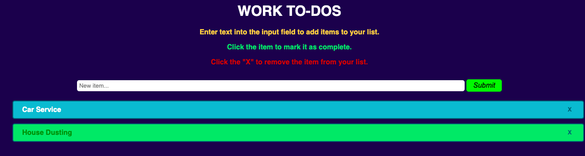

# To-DO LIST
**Project problem**
> Create a website to store your day to day Tasks

**Tech Stack**
>HTML ,CSS & JavaScript

**Project Discription**
>I chose this problem cause of my personal interest in creating website for daily use . This project also has a lot of features that i can keep adding as i move ahead in my training . I tried adding as many as gimmicks i could and will keep working on it in future.

> Here we can see that tasks once completed can be marked green and tasks remaining marked cion. 

